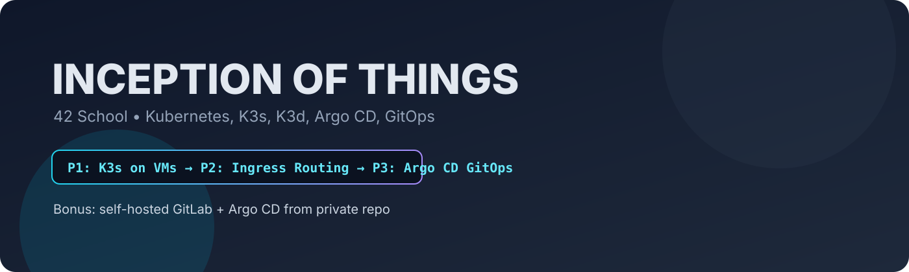
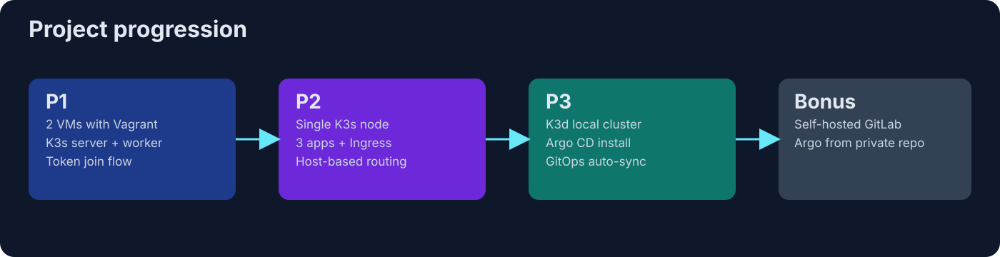
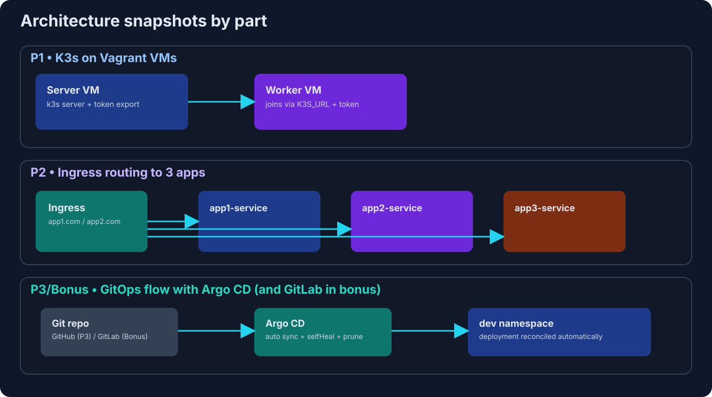

# Inception of Things (42 School)

<p align="center">
	
</p>

<p align="center">
	
	
	
	
</p>

## Tech stack

- Kubernetes (`k3s`, `k3d`)
- GitOps (`Argo CD`)
- Virtualization (`Vagrant`, `VirtualBox`)
- Container tooling (`Docker`, `Helm`, `kubectl`)
- CI/CD source hosting (`GitLab`, Git-based workflows)
- Infrastructure scripting (`Bash`, YAML manifests)

## Key achievements

- Built a **multi-node Kubernetes cluster** on VMs using K3s server/worker bootstrap.
- Deployed multiple apps with **service discovery + ingress routing** by hostname.
- Implemented **GitOps continuous delivery** using Argo CD with automated sync, prune, and self-heal.
- Integrated a **self-hosted GitLab source of truth** for private in-cluster application delivery.
- Automated setup and teardown flows for all parts with reproducible scripts and Makefile commands.

---

## 1) What is this project?

**Inception of Things (IOT)** is a 42 DevOps/System Administration project focused on Kubernetes from a practical perspective.

You learn to:

- create clusters in different environments,
- deploy apps with Kubernetes manifests,
- route traffic with Ingress,
- apply GitOps with Argo CD,
- and in bonus, run a private GitLab source for Argo CD.

This repository has all required parts:

- `p1` -> K3s multi-node on VMs (Vagrant)
- `p2` -> K3s app deployments + Ingress routing
- `p3` -> K3d + Argo CD + auto-sync from Git
- `bonus` -> GitLab + Argo CD from private internal repo

---

## 2) Learning roadmap (from beginner to advanced)

<p align="center">
	
</p>

Recommended order:

1. **P1 first** (cluster fundamentals)
2. **P2 second** (services + ingress)
3. **P3 third** (GitOps)
4. **Bonus last** (self-hosted GitLab + private GitOps)

---

## 3) High-level architecture by parts

<p align="center">
	
</p>

---

## 4) Repository structure

```text
inception-of-things/
├── README.md
├── assets/
│   ├── iot-banner.svg
│   ├── iot-roadmap.svg
│   └── iot-architecture.svg
├── p1/
│   ├── Makefile
│   ├── vagrantfile
│   └── scripts/
│       ├── server_script.sh
│       └── worker_script.sh
├── p2/
│   ├── Makefile
│   ├── vagrantfile
│   ├── confs/
│   │   ├── app1.yaml
│   │   ├── app2.yaml
│   │   ├── app3.yaml
│   │   ├── ingress.yaml
│   │   └── config
│   └── scripts/
│       └── setup_script.sh
├── p3/
│   ├── Makefile
│   ├── confs/
│   │   └── argo_app.yaml
│   └── scripts/
│       ├── setup_script.sh
│       ├── app.sh
│       └── clean.sh
└── bonus/
		├── Makefile
		├── confs/
		│   └── deploy.yml
		└── scripts/
				├── install.sh
				├── gitlab_set.sh
				└── clean.sh
```

---

## 5) Prerequisites

Depending on the part:

- **P1/P2**

  - VirtualBox
  - Vagrant
  - internet access for K3s + ingress downloads
- **P3/Bonus**

  - Docker (for K3d)
  - kubectl
  - k3d (installed by scripts in your repo)
  - Helm (bonus script installs it)

General:

- Linux/macOS shell (scripts are bash-oriented)
- `sudo` access

---

## 6) Part 1 - K3s server + worker using Vagrant

## Objective

Create a lightweight Kubernetes cluster (K3s) on 2 VMs:

- server: `yoyahyaS` at `192.168.56.110`
- worker: `yoyahyaSW` at `192.168.56.111`

## Key files

- `p1/vagrantfile`
- `p1/scripts/server_script.sh`
- `p1/scripts/worker_script.sh`

## How it works

- Server installs K3s and writes node token to `/vagrant/token`
- Worker reads `/vagrant/token` and joins server via:
  - `K3S_URL=https://<server_ip>:6443`
  - `K3S_TOKEN=<token>`

## Commands

```bash
cd p1
make
vagrant ssh yoyahyaS
kubectl get nodes
```

Destroy:

```bash
make clean
```

## Professional highlights from this part

- Why token-based joining is required
- Difference between control-plane node and worker node
- Why private network is used

---

## 7) Part 2 - App deployments + ingress routing

## Objective

Run 3 apps and route traffic by host through an ingress controller.

## Key files

- `p2/scripts/setup_script.sh`
- `p2/confs/app1.yaml`
- `p2/confs/app2.yaml`
- `p2/confs/app3.yaml`
- `p2/confs/ingress.yaml`

## What your setup script does

- installs K3s with Traefik disabled,
- installs NGINX ingress controller,
- waits for ingress controller readiness,
- applies app manifests and ingress.

## Routing logic

From your `ingress.yaml`:

- `app1.com` -> `app1-service`
- `app2.com` -> `app2-service`
- default/catch-all -> `app3-service`

## Commands

```bash
cd p2
make
vagrant ssh yoyahyaS
kubectl get pods -A
kubectl get ingress
kubectl get svc
```

Test hosts (add in `/etc/hosts` if needed):

```text
<vm-ip> app1.com
<vm-ip> app2.com
```

Destroy:

```bash
make clean
```

## Professional highlights from this part

- Service vs Deployment vs Ingress
- Why ingress controller is needed
- Why app2 has `replicas: 3`

---

## 8) Part 3 - K3d + Argo CD + GitOps

## Objective

Use GitOps workflow: app state in Git, Argo CD syncs to cluster automatically.

## Key files

- `p3/scripts/setup_script.sh`
- `p3/scripts/app.sh`
- `p3/confs/argo_app.yaml`
- `p3/scripts/clean.sh`

## What your scripts do

`setup_script.sh`:

- install K3d,
- create cluster `p3-cluster`,
- create namespaces `argocd` and `dev`,
- install Argo CD,
- wait for Argo CD pods,
- print Argo admin password,
- port-forward Argo server (`8085:443`),
- run `scripts/app.sh`.

`app.sh`:

- apply Argo Application manifest,
- clone source repo,
- wait for app service,
- port-forward app service (`svc-wil`) to local `8888`.

`argo_app.yaml` uses:

- automated sync
- `prune: true`
- `selfHeal: true`

## Commands

```bash
cd p3
make
```

Check Argo CD:

```bash
kubectl get pods -n argocd
kubectl get applications.argoproj.io -n argocd
```

Optional UI access:

```bash
kubectl port-forward svc/argocd-server -n argocd 8085:443
```

Cleanup:

```bash
make clean
```

## Professional highlights from this part

- Why GitOps is different from manual `kubectl apply`
- Meaning of `selfHeal` and `prune`
- Why Argo CD Application points to namespace `dev`

---

## 9) Bonus - GitLab + Argo CD from private internal repo

## Objective

Replace public Git source with self-hosted GitLab inside cluster.

## Key files

- `bonus/scripts/install.sh`
- `bonus/scripts/gitlab_set.sh`
- `bonus/confs/deploy.yml`
- `bonus/scripts/clean.sh`

## What happens

`install.sh`:

- creates `bonus-cluster`,
- creates namespaces `gitlab`, `argocd`, `dev`,
- installs Argo CD,
- installs Helm,
- deploys GitLab via Helm chart,
- waits for readiness,
- prints GitLab and Argo admin passwords,
- port-forwards GitLab and Argo UI.

`gitlab_set.sh`:

- retrieves GitLab root password,
- creates `.netrc` for auth,
- clones GitLab repo,
- copies deployment file,
- pushes update,
- applies Argo app (`deploy.yml`).

`deploy.yml` points Argo to in-cluster GitLab URL:

- `repoURL: http://gitlab-webservice-default.gitlab.svc:8181/root/testrepo.git`

## Commands

```bash
cd bonus
make
./scripts/gitlab_set.sh
kubectl get applications.argoproj.io -n argocd
```

Cleanup:

```bash
make clean
```

## Professional highlights from this part

- Why internal service DNS (`*.svc`) is used
- Difference between public Git source and in-cluster private GitLab
- Why host entry `gitlab.k3d.gitlab.com` is added

---

## 10) End-to-end quick start

If you want to run all mandatory parts in order:

```bash
cd p1 && make
# verify then destroy if needed
cd ../p2 && make
# verify then destroy if needed
cd ../p3 && make
```

---

## 11) Troubleshooting guide

## P1 worker does not join

- Ensure `/vagrant/token` exists on server
- Verify server reachable on `192.168.56.110:6443`
- Check worker script shebang typo (`!#/bin/bash` should be `#!/bin/bash`)

## P2 ingress not routing

- Ensure ingress-nginx controller pod is Ready
- Check `/etc/hosts` mapping for `app1.com` and `app2.com`
- Verify ingress class name is `nginx`

## P3 Argo app not syncing

- Check Argo app spec (`repoURL`, `path`, `targetRevision`)
- `kubectl describe application wil-app -n argocd`
- Check repo accessibility from cluster

## Bonus GitLab unavailable

- GitLab helm install can take long; recheck pods:

```bash
kubectl get pods -n gitlab
```

- Verify port-forward process is running
- Check `/etc/hosts` contains `127.0.0.1 gitlab.k3d.gitlab.com`

---

## 12) Security and quality notes for production mindset

These are practical improvements to make this project more production-ready:

- In `p1/scripts/worker_script.sh`, fix shebang to:

```bash
#!/bin/bash
```

- Avoid cloning repos in provisioning scripts unless required by subject.
- Use explicit error handling:

```bash
set -euo pipefail
```

- Prefer pinned versions for external manifests/charts when possible.
- Keep cleanup scripts idempotent (safe to run multiple times).

---

## 13) Interview talking points (what this project proves)

1. **P1:** "I built a real K3s cluster with server/agent join token across two VMs."
2. **P2:** "I deployed multiple services and implemented hostname-based ingress routing."
3. **P3:** "I implemented GitOps with Argo CD, including automated sync, prune, and self-heal."
4. **Bonus:** "I integrated self-hosted GitLab with Argo CD for private in-cluster delivery."

---

## 14) Useful references

- https://hackmd.io/@nszl/BJYuuBdnh
- https://velog.io/@sejokim/42Seoul-Inception-of-things-%ED%8F%89%EA%B0%80-%EC%A4%80%EB%B9%84

---

## 15) Final summary

This project is a progressive path:

- from **cluster basics** (P1),
- to **application networking** (P2),
- to **automation and desired-state delivery** (P3),
- to **private enterprise-like GitOps** (Bonus).
